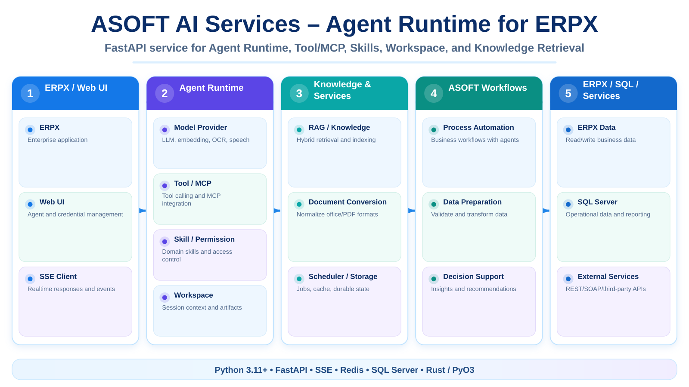

# 🧠 ASOFT AI Services – Agent Runtime for ERPX

> Nền tảng **AI Agent Service bằng Python** dành cho hệ sinh thái ERPX, cung cấp Agent Runtime, Model Provider, Tool/MCP, Skill, Workspace, RAG và các API tích hợp doanh nghiệp.

\n  \n
\n
---

## 📌 Giới thiệu

AI_Agent_for_ALL là source của **ASOFT AI Services**. Mục tiêu của dự án là đưa các khả năng AI vào ERPX thông qua một lớp service độc lập, có thể mở rộng theo provider, tool và nghiệp vụ mà không khóa hệ thống vào một mô hình duy nhất.

Dự án hỗ trợ từ chat/stream cơ bản đến các luồng Agent phức tạp có Tool, MCP, Skill, Permission, Workspace, Knowledge Factory và lưu trữ bền vững.

---

## 🚀 Chức năng chính

- 🤖 **Agent Runtime**: quản lý Agent, Message, Event, middleware và trạng thái runtime.
- 💬 **Streaming chat**: trả event theo thời gian thực cho ERPX/Web UI.
- 🧠 **Model Providers**: lớp tích hợp model text, embedding, OCR, speech và credential.
- 🛠️ **Tool Runtime**: đăng ký, tìm kiếm và thực thi tool theo user/agent/session.
- 🔌 **MCP**: kết nối MCP server và đưa MCP tool vào Agent Runtime.
- 🧩 **Skill Management**: nạp skill và gắn capability theo runtime.
- 🔐 **Permission & Workspace**: kiểm soát quyền thực thi và workspace của Agent.
- 📚 **RAG / Knowledge Factory**: chuẩn hóa tài liệu, chunking, embedding và truy xuất knowledge.
- 📄 **Document Conversion**: chuyển DOC/DOCX/XLS/XLSX/PPT/PPTX/PDF/EPUB/RTF/CSV thành Markdown bằng native Rust/PyO3 runtime.
- 💾 **Durable Storage**: hỗ trợ Redis và các storage backend mở rộng.
- 🏢 **ERPX Integration**: workflow và tool chuyên biệt nằm trong lớp ASOFT.

---

## 🏗️ Kiến trúc tổng quan

~~~text
ERPX / Web UI
     │
     ▼
FastAPI Service
     │
     ├── Agent Runtime
     │     ├── Model Provider
     │     ├── Tool / MCP
     │     ├── Skill
     │     ├── Permission
     │     └── Workspace
     │
     ├── RAG / Knowledge
     ├── Document Conversion
     ├── Scheduler / Storage
     └── ASOFT Business Workflows
             │
             ▼
        ERPX / SQL / Services
~~~

---

## 🧱 Các lớp chính

| Thành phần | Vai trò |
|---|---|
| Runtime | Agent, event, message, middleware, runtime state |
| Providers | LLM, embedding, OCR, speech, credential |
| Capabilities | Tool, MCP, RAG, Skill, Permission, Workspace, Document Conversion |
| ASOFT | Workflow nghiệp vụ ERPX, Knowledge Factory |
| Service | FastAPI app, API, scheduler, storage, Web UI API |
| Common | Kiểu dữ liệu, exception và utility dùng chung |

---

## 📚 Knowledge Factory

Knowledge Factory xử lý dữ liệu knowledge đã được ERPX duyệt/publish theo luồng:

~~~text
ERPX Publish
   ↓
Indexing Job
   ↓
Load Snapshot + Object + Relation + Source File
   ↓
Document Conversion
   ↓
Canonical Markdown
   ↓
Chunking
   ↓
Embedding
   ↓
Vector + Metadata
   ↓
Commit về storage / SQL
~~~

Mã nguồn nghiệp vụ nằm trong:

~~~text
src/ASOFT/knowledge_factory/
~~~

---

## 🛠️ Công nghệ sử dụng

- 🐍 **Python 3.11+**
- ⚡ **FastAPI**
- 🔌 **MCP / FastMCP**
- 🧠 **OpenAI / Ollama và các model provider**
- 💾 **Redis**
- 📚 **RAG / Embedding**
- 🦀 **Rust + PyO3 + Maturin** cho Document Conversion
- 🌐 **React / TypeScript** cho Web UI development
- 🔄 **SSE / realtime event streaming**
- 🗄️ **SQL Server / ERPX integration**

---

## 📂 Cấu trúc dự án

~~~text
AI_Agent_for_ALL/
├── src/
│   ├── Common/
│   ├── Providers/
│   ├── Capabilities/
│   ├── Runtime/
│   ├── Service/
│   └── ASOFT/
├── service/
│   ├── main.py                  # Standalone FastAPI host
│   ├── settings/
│   └── workspaces/
├── development/
│   └── Web_UI/                  # Web UI phục vụ DEV/TEST
├── scripts/
├── docs/
├── pyproject.toml
├── requirements.txt
└── README.md
~~~

---

## ⚙️ Cài đặt

### Yêu cầu

- Python 3.11+
- uv 0.12.x
- Git
- Redis nếu chạy durable storage
- Rust >= 1.88 + Visual Studio C++ Toolset nếu build native Document Conversion

### Đồng bộ dependency

~~~powershell
git clone https://github.com/tttiuem2k3/AI_Agent_for_ALL.git
cd AI_Agent_for_ALL
uv sync --all-extras
~~~

### Chạy standalone service

~~~powershell
uv run python service/main.py
~~~

Mặc định service chạy tại:

~~~text
http://localhost:8000
~~~

Health check:

~~~text
GET /health/live
GET /health/ready
~~~

---

## 🖥️ Web UI Development

~~~powershell
cd development/Web_UI
pnpm install
pnpm dev
~~~

Web UI dùng để quản lý/test Agent, Credential, Session, Schedule, MCP, Skill, Workspace và luồng SSE.

---

## 📄 Document Conversion

Application code chỉ gọi public API của Capabilities.document_conversion.

Native converter được đóng gói bằng Rust/PyO3 và trả tài liệu đã chuẩn hóa về Markdown.

---

## 🔒 Lưu ý cấu hình

- Không commit API key, Redis password hoặc SQL connection string.
- Credential được inject bằng biến môi trường/process manager.
- Workspace và dữ liệu runtime nên nằm ngoài source production khi triển khai.

---

## 📞 Liên hệ

- 📧 Email: tttiuem2k3@gmail.com
- 👥 LinkedIn: [Thịnh Trần](https://www.linkedin.com/in/thinh-tran-04122k3/)
- 💬 Zalo / Phone: +84 329966939 | +84 336639775

---
