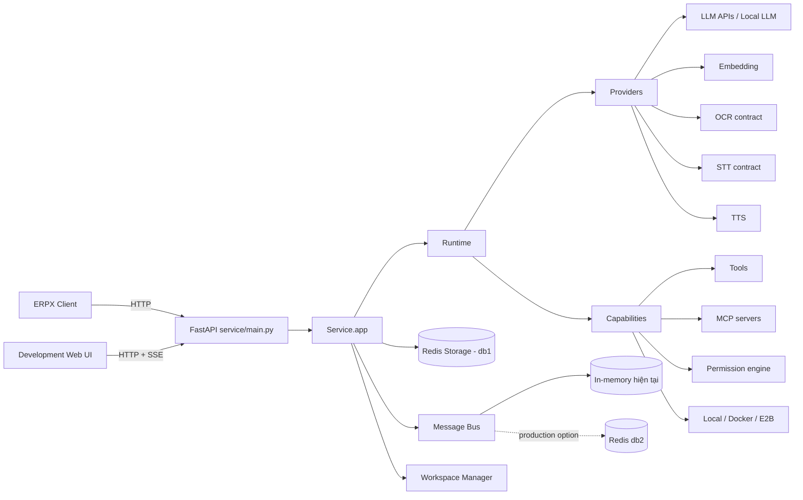
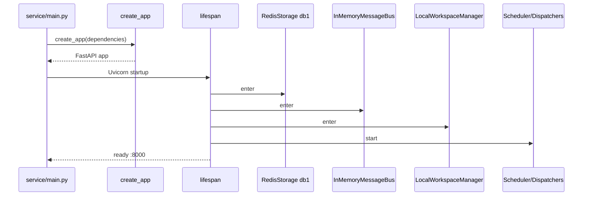
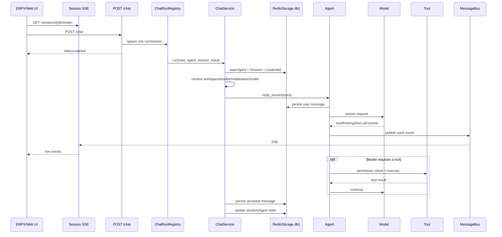

# Kiến trúc và cấu trúc mã nguồn ASOFT AI Services

## 1. Mục đích tài liệu

Tài liệu này mô tả cấu trúc thực tế của repository `ASOFT_AI_SERVICES`, chức năng
của các thư mục mã nguồn đến bốn cấp, vị trí của luồng chạy chính, luồng phục
vụ phát triển/kiểm thử, tài liệu, cấu hình cài đặt và dữ liệu runtime.

ASOFT AI Services là nền tảng dịch vụ AI bằng Python do ASOFT phát triển cho
ERPX. Hệ thống cung cấp:

- Agent runtime và vòng lặp suy luận/tool.
- Adapter LLM, embedding, OCR, STT và TTS.
- Tool, MCP, permission, skill và workspace.
- FastAPI service nhiều user, agent và session.
- Redis storage, message bus, scheduler và background task.
- Web UI phục vụ phát triển, chat và quản trị cấu hình.

## 2. Quy ước phân loại

Các nhãn sau được sử dụng xuyên suốt tài liệu:

| Nhãn | Ý nghĩa |
|---|---|
| **`[MAIN]`** | Mã nguồn thuộc luồng nghiệp vụ chính của AI Services |
| **`[ENTRYPOINT]`** | Lớp hoặc file được chạy để khởi động hệ thống |
| **`[DEV]`** | Mã nguồn/chương trình chỉ phục vụ phát triển, demo hoặc kiểm thử |
| **`[DOCS]`** | Tài liệu, không tham gia runtime |
| **`[CONFIG]`** | Cấu hình build, dependency, test hoặc package |
| **`[MODEL DATA]`** | Model weights/cache cục bộ, không phải source code |
| **`[RUNTIME DATA]`** | Dữ liệu phát sinh khi hệ thống chạy |
| **`[GENERATED]`** | Artifact được công cụ sinh tự động, không phải source code |

### 2.1 Chú giải màu và khu vực trong sơ đồ cấu trúc

Sơ đồ cấu trúc mã nguồn sử dụng màu để nhận biết nhanh vai trò của từng khu
vực. Màu chỉ biểu thị **trách nhiệm kiến trúc**, không biểu thị quyền truy cập
hay mức độ bảo mật.

| Màu/nhãn | Khu vực tương ứng | Chức năng |
|---|---|---|
| Cam — **`[ENTRYPOINT]`** | `service`, đặc biệt là `service/main.py` | Điểm khởi động backend; khởi tạo FastAPI, Redis, message bus, workspace, MCP, CORS và Uvicorn |
| Xanh navy — **`[MAIN SOURCE]`** | `src/Common`, `src/Providers`, `src/Capabilities`, `src/Runtime`, `src/Service` | Mã nguồn production tạo nên toàn bộ AI Services |
| Xanh lá — **`[DEV][TEST]`** | `development/Web_UI_test`, `development/tests`, `development/scripts`, `development/samples` | Giao diện thử nghiệm, kiểm thử, ví dụ và công cụ hỗ trợ phát triển; không thuộc luồng production |
| Tím — **`[DOCS]`** | `docs`, `README.md` | Hướng dẫn cài đặt, tài liệu kiến trúc và thông tin bắt đầu nhanh |
| Xanh ngọc — **`[CONFIG][INSTALL]`** | `pyproject.toml`, `uv.lock`, `requirements.txt`, `.gitignore` | Cấu hình package, dependency, phiên bản khóa, cài đặt pip/uv và quy tắc Git |
| Xám — **`[MODEL DATA]`** | `models` | Model weights và cache cục bộ; không phải mã nguồn và không nên commit vào Git |
| Nâu — **`[RUNTIME DATA]`** | `service/workspaces` | File được tạo trong lúc chạy theo user, agent hoặc session; có thể xóa/tạo lại tùy chính sách lưu trữ |

#### Chú giải trực tiếp cho từng thư mục chính

| Đường dẫn | Chức năng dễ hiểu |
|---|---|
| `service/` | Lớp ứng dụng chạy thực tế, ghép các thành phần lõi thành một backend hoàn chỉnh |
| `service/main.py` | File chạy đầu tiên của backend |
| `service/skills/` | Skill, instruction và tài nguyên mặc định được nạp cho Agent |
| `service/workspaces/` | Dữ liệu làm việc phát sinh khi Agent hoạt động |
| `src/` | Source root chứa toàn bộ mã nguồn Python production |
| `src/Common/` | Utility, exception và kiểu dữ liệu dùng chung |
| `src/Providers/` | Nhóm Credential dùng chung, modelLLM và modelBSN |
| `src/Providers/modelLLM/` | Chat/LLM model và formatter theo từng Provider |
| `src/Providers/modelBSN/` | Model chuyên biệt theo chức năng: embedding, OCR, STT và TTS |
| `src/Capabilities/` | Tool, MCP, permission, skill và môi trường thực thi của Agent |
| `src/Runtime/` | Vòng lặp Agent, message, event streaming, state và middleware |
| `src/Service/` | FastAPI, router, service nghiệp vụ, manager, storage và message bus |
| `development/Web_UI_test/` | React Web UI và Node backend dùng để phát triển, thử nghiệm |
| `development/tests/` | Unit test và integration test |
| `development/scripts/` | Script kiểm tra provider, benchmark và công cụ DEV |
| `development/samples/` | Ví dụ tích hợp độc lập, chẳng hạn Mem0 |
| `docs/` | Tài liệu cài đặt và kiến trúc |
| `models/` | Nơi lưu model weights/cache cục bộ |

Luồng production được đọc theo thứ tự:

```text
ERPX/Web UI
    → service/main.py
    → Service
    → Runtime
    → Providers + Capabilities
    → Common
```

> **Quy tắc ranh giới:** mã nguồn production trong `service` và `src` không
> được import ngược từ `development`. Thư mục `development` chỉ được phép dùng
> mã nguồn production để chạy giao diện thử nghiệm, test, sample và tooling.

## 3. Bản đồ kiến trúc tổng thể



### 3.1 Thành phần chạy thực tế

| Thành phần | Vị trí | Vai trò |
|---|---|---|
| Composition root | `service/main.py` | Khởi tạo dependency và chạy Uvicorn |
| App factory | `src/Service/app/_app.py` | Tạo FastAPI app và đăng ký router |
| App lifecycle | `src/Service/app/_lifespan.py` | Mở/đóng storage, bus, workspace và manager |
| Chat orchestration | `src/Service/app/_service/_chat.py` | Lắp ráp và thực thi một lượt Agent |
| Agent runtime | `src/Runtime/agent/_agent.py` | Vòng lặp model, tool, permission và event |
| Provider adapters | `src/Providers` | Giao tiếp các model/provider |
| Agent capabilities | `src/Capabilities` | Tool, MCP, skill, permission, workspace |

### 3.2 Hướng phụ thuộc

Hướng phụ thuộc khái quát:

```text
service/main.py
    ↓
Service
    ↓
Runtime
    ↓
Providers + Capabilities
    ↓
Common
```

Trong triển khai thực tế, `Providers` và `Capabilities` sử dụng các kiểu message
hoặc state của `Runtime`. Vì vậy đây là ranh giới module logic, không phải một
đồ thị phụ thuộc tuyệt đối một chiều.

## 4. Cấu trúc repository đến bốn cấp

Thư mục repository không được tính là một cấp. Cây dưới đây thể hiện tối đa
bốn cấp thư mục bên dưới `ASOFT_AI_SERVICES`.

```text
ASOFT_AI_SERVICES/
├── service/                                      [ENTRYPOINT][MAIN]
│   ├── skills/                                   [MAIN CONFIG]
│   └── workspaces/                               [RUNTIME DATA]
├── src/                                          [MAIN]
│   ├── Common/                                   [MAIN]
│   │   ├── _utils/
│   │   ├── exception/
│   │   └── types/
│   ├── Providers/                                [MAIN]
│   │   ├── credential/
│   │   ├── modelLLM/
│   │   │   ├── model/
│   │   │   └── formatter/
│   │   └── modelBSN/
│   │       ├── embedding/
│   │       ├── ocr/
│   │       ├── stt/
│   │       └── tts/
│   ├── Capabilities/                             [MAIN]
│   │   ├── mcp/
│   │   ├── permission/
│   │   ├── skill/
│   │   ├── tool/
│   │   └── workspace/
│   ├── Runtime/                                  [MAIN]
│   │   ├── agent/
│   │   ├── event/
│   │   ├── message/
│   │   ├── middleware/
│   │   └── state/
│   ├── Service/                                  [MAIN]
│   │   └── app/
│   └── asoft_ai_services.egg-info/               [GENERATED]
├── development/                                  [DEV]
│   ├── Web_UI_test/                              [DEV ENTRYPOINT]
│   │   ├── frontend/
│   │   │   ├── public/
│   │   │   └── src/
│   │   └── backend/
│   │       └── src/
│   ├── tests/                                    [DEV TEST]
│   ├── scripts/                                  [DEV TOOLING]
│   │   └── model_examples/
│   └── samples/                                  [DEV SAMPLE]
│       └── long_term_memory/
│           └── mem0/
├── docs/                                         [DOCS]
│   ├── huong_dan_cai_dat.md
│   ├── kien_truc_du_an.md
│   └── Thong_tin_API_ASOFT_AI_SERVICES.md
├── models/                                       [MODEL DATA]
├── pyproject.toml                                [CONFIG]
├── uv.lock                                       [CONFIG]
├── requirements.txt                              [CONFIG]
├── .gitignore                                    [CONFIG]
└── README.md                                     [DOCS]
```

## 5. Lớp chạy chính: `service`

### 5.1 `service/main.py` — `[ENTRYPOINT][MAIN]`

Đây là composition root của backend. File này chịu trách nhiệm:

1. Tạo danh sách MCP mặc định.
2. Bổ sung AMap MCP khi có `AMAP_API_KEY`.
3. Khởi tạo `RedisStorage` tại Redis logical database `db1`.
4. Chọn `InMemoryMessageBus` cho cấu hình một process hiện tại.
5. Khởi tạo `LocalWorkspaceManager`.
6. Đăng ký subagent template `explorer` ở chế độ chỉ đọc.
7. Cấu hình CORS.
8. Gọi `create_app(...)`.
9. Chạy Uvicorn tại `0.0.0.0:8000`.

Lệnh chạy:

```powershell
uv run python service/main.py
```

### 5.2 `service/skills` — `[MAIN CONFIG]`

Chứa skill cài sẵn cho Agent service. Skill là instruction và tài nguyên mở
rộng được nạp vào workspace/toolkit mà không sửa trực tiếp Agent core.

### 5.3 `service/workspaces` — `[RUNTIME DATA]`

Chứa workspace được tạo theo user/agent/session khi dùng
`LocalWorkspaceManager`. Đây không phải source code và đã được loại khỏi Git.

Trong production nên thay bằng volume, object storage hoặc workspace backend
được cô lập.

### 5.4 `service/README.md` — `[DOCS]`

Hướng dẫn ngắn để cài dependency, chạy Redis, backend và Web UI.

## 6. Các Python package chính trong `src`

`src` là source root, không phải một package để import. Cấu trúc phẳng hiện
tại cung cấp năm top-level package:

```python
import Common
import Providers
import Capabilities
import Runtime
import Service
```

Distribution được build từ `pyproject.toml` có tên:

```text
asoft-ai-services
```

### 6.1 Module và typing marker tại source root

| File | Chức năng |
|---|---|
| `_logging.py` | Module logging dùng chung, được đóng gói bằng `py-modules` |
| `_version.py` | Version distribution dùng cho build và FastAPI |
| `<package>/py.typed` | Đánh dấu từng top-level package hỗ trợ PEP 561 |

## 7. `Common` — nền tảng dùng chung `[MAIN]`

```text
Common/
├── _utils/
│   ├── _audio.py
│   ├── _common.py
│   └── _mixin.py
├── exception/
│   ├── _base.py
│   └── _tool.py
└── types/
    ├── _hook.py
    ├── _json.py
    └── _object.py
```

| Thư mục | Chức năng |
|---|---|
| `_utils` | ID factory, timestamp, JSON repair/serialization, WAV header và dictionary mixin |
| `exception` | Exception chung và lỗi liên quan tool |
| `types` | Kiểu JSON, hook type và embedding object dùng xuyên package |

`Common` không chứa business orchestration và không biết FastAPI hay Redis.

## 8. `Providers` — adapter AI provider `[MAIN]`

```text
Providers/
├── credential/
├── modelLLM/
│   ├── formatter/
│   └── model/
│       ├── _anthropic/
│       ├── _dashscope/
│       ├── _deepseek/
│       ├── _gemini/
│       ├── _moonshot/
│       ├── _ollama/
│       ├── _openai_chat/
│       ├── _openai_response/
│       └── _xai/
└── modelBSN/
    ├── embedding/
    │   ├── _dashscope/
    │   ├── _gemini/
    │   ├── _ollama/
    │   └── _openai/
    ├── ocr/
    ├── stt/
    └── tts/
        └── _dashscope/
```

### 8.1 `credential`

Định nghĩa credential schema cho:

- Anthropic.
- DashScope.
- DeepSeek.
- Gemini.
- Moonshot/Kimi.
- Ollama.
- OpenAI.
- xAI.

`CredentialFactory` đăng ký loại credential và khởi tạo credential từ dữ liệu
được lưu theo user.

### 8.2 `modelLLM/formatter`

Chuyển `Runtime.message.Msg` sang payload riêng của từng provider:

- Role system/user/assistant.
- Text, thinking và hint.
- Tool call và tool result.
- Image/audio/PDF/multimodal data.
- Multi-agent conversation.

Formatter giúp Agent runtime không phụ thuộc SDK hay wire format của provider.

### 8.3 `modelLLM/model`

Thành phần chính:

| Thành phần | Chức năng |
|---|---|
| `_base.py` | `ChatModelBase`, retry, token estimate và structured output |
| `_model_card.py` | Metadata model và schema tham số |
| `_model_response.py` | Chat/structured response chuẩn hóa |
| `_model_usage.py` | Token usage |
| `_*/_model.py` | Adapter gọi API/provider cụ thể |
| `_*/_models/*.yaml` | Catalog model được hiển thị và validate |

OpenAI được tách thành:

- `_openai_chat`: Chat Completions API.
- `_openai_response`: Responses API.

Ollama là adapter hiện có cho model local chạy qua Ollama server. Model weights
không được đặt trong package này.

### 8.4 `modelBSN/embedding`

Bao gồm:

- `EmbeddingModelBase`.
- Response và usage chuẩn hóa.
- Model card.
- Cache interface và file cache.
- Adapter DashScope, Gemini, Ollama và OpenAI.
- YAML catalog nằm trong `_models`.

### 8.5 `modelBSN/ocr`

Hiện là contract provider-independent:

- `OCRModelBase`.
- `OCRModelCard`.
- `OCRResponse`, `OCRPage`, `OCRTextBlock`, `OCRUsage`.

Chưa có PaddleOCR implementation cụ thể. Provider local tương lai nên đặt tại:

```text
Providers/modelBSN/ocr/_paddleocr/
```

### 8.6 `modelBSN/stt`

Hiện là contract provider-independent:

- `STTModelBase`.
- `STTModelCard`.
- `STTResponse`, `STTSegment`, `STTUsage`.

Provider local tương lai như Faster Whisper nên đặt tại:

```text
Providers/modelBSN/stt/_faster_whisper/
```

### 8.7 `modelBSN/tts`

Chứa:

- TTS base contract, response, usage và model card.
- DashScope TTS thông thường.
- DashScope realtime TTS.
- CosyVoice realtime TTS.
- YAML model/voice catalog.

## 9. `Capabilities` — khả năng của Agent `[MAIN]`

```text
Capabilities/
├── document_conversion/
│   ├── _native/
│   │   └── binding/
│   └── _vendor/
├── mcp/
├── permission/
├── rag/
├── skill/
├── tool/
│   ├── _builtin/
│   │   └── _scripts/
│   └── _task/
└── workspace/
    ├── _docker/
    ├── _e2b/
    └── _mcp_gateway/
```

### 9.1 `mcp`

`MCPClient` và cấu hình kết nối MCP:

- Stdio.
- HTTP/SSE.
- Streamable HTTP.

MCP tools được chuyển thành tool contract chung để đăng ký vào `Toolkit`.

### 9.2 `permission`

Permission engine kiểm tra tool trước khi thực thi.

| Thành phần | Chức năng |
|---|---|
| `_context.py` | Permission context và working directory bổ sung |
| `_rule.py` | Rule theo tool/pattern |
| `_decision.py` | Kết quả kiểm tra |
| `_engine.py` | Thuật toán áp dụng mode và rule |
| `_types.py` | `ALLOW`, `DENY`, `ASK` và permission mode |

Các mode chính gồm default, accept edits, explore, bypass và don't ask.

### 9.3 `skill`

- `Skill`: metadata và nội dung skill.
- `SkillLoaderBase`: interface nạp skill.
- `LocalSkillLoader`: nạp skill từ filesystem.

### 9.4 `tool`

Thành phần:

| Thư mục/file | Chức năng |
|---|---|
| `_base.py` | Tool contract và middleware contract |
| `_toolkit.py` | Registry, schema và dispatcher tool |
| `_tool_group.py` | Bật/tắt tool theo nhóm |
| `_adapters.py` | Chuyển callable/MCP thành tool |
| `_response.py` | Streaming `ToolChunk`/`ToolResponse` |
| `_builtin` | Bash, Read, Write, Edit, Glob, Grep, SkillViewer, meta tool |
| `_builtin/_scripts` | Helper subprocess cho built-in tool |
| `_task` | TaskCreate, TaskGet, TaskList, TaskUpdate |

### 9.5 `workspace`

Workspace cung cấp filesystem và execution boundary cho Agent.

| Thư mục | Chức năng |
|---|---|
| `_local_workspace.py` | Workspace chạy trực tiếp trên máy host |
| `_docker` | Docker backend/workspace và Dockerfile templates |
| `_e2b` | E2B remote sandbox |
| `_mcp_gateway` | Gateway MCP chạy gần sandbox |
| `_gateway_client.py` | Client giao tiếp gateway |
| `_offload_protocol.py` | Contract offload dữ liệu/file lớn |
| `_utils.py` | Tìm project root và đóng gói source cho sandbox |

### 9.6 `document_conversion`

Capability chuyển đổi tài liệu dùng chung nằm tại
`src/Capabilities/document_conversion`. Public Python API không phụ thuộc trực
tiếp vào tên crate/native package và chỉ load native backend khi thực sự convert.

```text
document_conversion/
├── _base.py
├── _backend.py
├── _errors.py
├── _models.py
├── _service.py
├── _structure.py
├── _native/
│   └── binding/
└── _vendor/
```

`_native` là Rust workspace đã làm phẳng từ maintained fork. `_vendor` quản lý
sync, parity, SHA-256 manifest, upstream metadata, license và native build.
Application code không import `_native` trực tiếp.

### 9.7 `rag`

`Capabilities.rag` giữ các parser/vector-store contract dùng chung.
`DocumentConversionParser` chuyển Markdown từ `DocumentConversionService` thành
RAG `Section`, trong khi `WordParser` và `ExcelParser` cũ vẫn giữ API tương thích.


## 10. `Runtime` — lõi thực thi Agent `[MAIN]`

```text
Runtime/
├── agent/
├── event/
├── message/
├── middleware/
│   ├── _longterm_memory/
│   │   └── _mem0/
│   └── _tracing/
└── state/
```

### 10.1 `message`

Message là trạng thái hội thoại bền vững:

- `SystemMsg`.
- `UserMsg`.
- `AssistantMsg`.
- Text/thinking/hint block.
- Tool-call/tool-result block.
- Data block với Base64 hoặc URL source.
- Usage.

### 10.2 `event`

Event biểu diễn thay đổi streaming trong một lượt trả lời:

- Reply/model call start và end.
- Text/thinking/data delta.
- Tool call/result delta.
- User confirmation.
- External execution.
- Custom event.
- Exceed max iterations.

Web UI nhận event qua SSE và ghép thành message hiển thị.

### 10.3 `state`

Lưu:

- Agent context.
- Task context.
- Permission context.
- Pending tool/execution state.
- Quan hệ task và trạng thái task.

State được serialize trong session storage để lượt chat tiếp theo có thể tiếp
tục đúng ngữ cảnh.

### 10.4 `middleware`

| Thành phần | Chức năng |
|---|---|
| `_base.py` | Middleware lifecycle/hook contract |
| `_budget.py` | Giới hạn budget của lượt trả lời |
| `_tts_middleware.py` | Chuyển text event thành audio |
| `_tracing` | OpenTelemetry spans, attributes và converter |
| `_longterm_memory/_mem0` | Long-term memory và adapter Mem0 |

### 10.5 `agent`

`Agent` thực hiện vòng lặp:

1. Nhận message hoặc continuation event.
2. Chuẩn bị context.
3. Chạy middleware hook.
4. Gọi chat model.
5. Phát event streaming.
6. Phân tích tool call.
7. Kiểm tra permission.
8. Thực thi tool hoặc phát yêu cầu xác nhận.
9. Đưa tool result trở lại model.
10. Lặp đến câu trả lời cuối hoặc giới hạn vòng lặp.
11. Cập nhật message và state.

Các cấu hình chính là `ContextConfig`, `ModelConfig` và `ReActConfig`.

## 11. `Service` — API và orchestration `[MAIN]`

```text
Service/
└── app/
    ├── _router/
    │   └── _schema/
    ├── _service/
    │   └── _projectors/
    ├── _manager/
    │   └── _scheduler/
    ├── message_bus/
    ├── storage/
    │   └── _model/
    ├── workspace_manager/
    ├── middleware/
    │   └── _protocol/
    ├── _tool/
    └── _tools/
```

### 11.1 App factory và lifecycle

| File | Chức năng |
|---|---|
| `_app.py` | `create_app`, dependency injection và router registration |
| `_lifespan.py` | Startup/shutdown bằng `AsyncExitStack` |
| `deps.py` | FastAPI dependencies và `X-User-ID` |
| `_types.py` | Factory types và subagent template |
| `_bus_ops.py` | Thao tác bus dùng chung |

Lifespan khởi tạo theo thứ tự:

1. Storage.
2. Message bus.
3. Workspace manager.
4. Background task manager.
5. Chat run registry.
6. Scheduler.
7. Chat service và session service.
8. Wakeup dispatcher.
9. Cancel dispatcher.

Khi shutdown, các resource được đóng theo thứ tự ngược lại.

### 11.2 `_router`

Router là lớp HTTP mỏng:

| Router | Chức năng |
|---|---|
| `_agent.py` | CRUD Agent |
| `_chat.py` | Kích hoạt chat run kiểu fire-and-forget |
| `_credential.py` | CRUD credential |
| `_model.py` | Liệt kê chat model |
| `_tts_model.py` | Liệt kê TTS model |
| `_schedule.py` | CRUD schedule |
| `_session.py` | Session, message và SSE stream |
| `_workspace.py` | MCP, skill và workspace operation |
| `_schema` | Pydantic request/response schema |

### 11.3 `_service`

Service layer chứa orchestration:

| File/thư mục | Chức năng |
|---|---|
| `_chat.py` | Lắp ráp và chạy Agent theo session |
| `_session.py` | Session lifecycle và cascade delete |
| `_model.py` | Tạo chat model từ config/credential |
| `_embedding.py` | Tạo embedding model |
| `_tts_model.py` | Tạo TTS model |
| `_toolkit.py` | Ghép workspace tool, task, schedule, team, MCP và custom tool |
| `_session_projection.py` | Chiếu event/session cho UI |
| `_projectors` | Project event HITL của subagent |

### 11.4 `_manager`

| Manager | Chức năng |
|---|---|
| `ChatRunRegistry` | Một in-flight run cho mỗi session trong process |
| `BackgroundTaskManager` | Theo dõi tool chạy nền |
| `SchedulerManager` | APScheduler và scheduled trigger |
| `WakeupDispatcher` | Nhận trigger và đánh thức session |
| `CancelDispatcher` | Hủy chat/background task |
| `_scheduler/_tools` | Tool tạo/xóa/xem/liệt kê schedule |

### 11.5 `message_bus`

Message bus tách live transport khỏi persistence:

- `MessageBus`: interface.
- `InMemoryMessageBus`: cấu hình hiện tại, phù hợp một process/dev.
- `RedisMessageBus`: nhiều process/production.
- `MessageBusKeys`: quy ước key/channel/queue.

Bus quản lý:

- Distributed/session lock.
- Live Pub/Sub.
- Event log để replay.
- Inbox.
- Wakeup/cancel queue.
- Background task registry.

### 11.6 `storage`

`StorageBase` định nghĩa persistence contract cho:

- User.
- Agent.
- Credential.
- Session.
- Message.
- Team.
- Schedule.

`RedisStorage` là implementation hiện tại. `storage/_model` chứa các record và
config Pydantic được serialize.

Cấu hình đang chạy:

```text
Redis host: localhost
Redis port: 6379
Storage DB: db1
Key prefix: ASOFT:
```

### 11.7 `workspace_manager`

Ánh xạ user/agent/session sang workspace:

- `LocalWorkspaceManager`.
- `DockerWorkspaceManager`.
- `E2BWorkspaceManager`.

Manager quản lý lifecycle và isolation; Agent chỉ làm việc qua
`WorkspaceBase`.

### 11.8 Service middleware

| Middleware | Chức năng |
|---|---|
| `InboxMiddleware` | Đưa message nền vào Agent context |
| `StateChangeMiddleware` | Publish state change |
| `ToolOffloadMiddleware` | Chuyển tool dài sang background |
| `_protocol/AGUIProtocolMiddleware` | Chuyển event sang AG-UI protocol |

### 11.9 `_tool` và `_tools`

Hai thư mục hiện cùng tồn tại và cùng chứa tool Agent/team.

- `_service/_toolkit.py` đang import từ `_tool`.
- `Service/app/__init__.py` đang export từ `_tools`.

Đây là vùng trùng lặp kỹ thuật cần hợp nhất trong một đợt refactor riêng. Không
nên xóa một thư mục chỉ dựa trên tên vì một số file giữa hai bên không hoàn
toàn giống nhau.

## 12. Luồng khởi động chính



## 13. Luồng chat chính của AI Services



Đặc điểm quan trọng:

- `POST /chat` không trả token stream trực tiếp.
- Event đi qua SSE của session.
- Cấu hình hiện tại dùng bus trong RAM nên event không ghi Redis theo từng
  token.
- Message và session state được lưu bền vững trong Redis `db1`.
- Khi bật `RedisMessageBus`, live event/lock/queue có thể dùng `db2`.

## 14. Human-in-the-loop và background flow

### 14.1 User confirmation

1. Permission engine trả `ASK`.
2. Agent phát `RequireUserConfirmEvent`.
3. UI hiển thị yêu cầu.
4. Client gửi `UserConfirmResultEvent`.
5. Router định tuyến đúng leader/worker session.
6. Trigger được enqueue.
7. `WakeupDispatcher` tiếp tục session.

### 14.2 Background tool

1. `ToolOffloadMiddleware` offload tool chạy lâu.
2. `BackgroundTaskManager` theo dõi task.
3. Kết quả được đưa vào inbox.
4. Wakeup trigger được phát.
5. Agent tiếp tục từ state đã lưu.

### 14.3 Scheduled task

1. Schedule được lưu trong storage.
2. `SchedulerManager` đăng ký APScheduler job.
3. Đến thời điểm chạy, trigger được đưa vào bus.
4. `WakeupDispatcher` gọi lại cùng `ChatService`.

## 15. Khu vực phát triển: `development` — `[DEV]`

Không thành phần nào trong `development` là dependency bắt buộc của các package
production trong `src`.

### 15.1 `development/tests` — `[DEV TEST]`

Chứa test suite cho:

- Agent, event, message và state.
- Formatter, chat model, embedding và TTS.
- OCR/STT base contract.
- Built-in tool, toolkit, task và permission.
- MCP.
- Local/Docker/E2B backend và workspace.
- Redis storage và message bus.
- Service scheduler, dispatcher, team và middleware.
- Tracing và Mem0.

`pyproject.toml` cấu hình:

```toml
[tool.pytest.ini_options]
testpaths = ["development/tests"]
```

Lệnh:

```powershell
uv run --extra dev pytest
uv run --extra dev pytest --collect-only -q
```

### 15.2 `development/scripts` — `[DEV TOOLING]`

```text
development/scripts/
├── model_examples/
└── generate_erpx_ai_service_document.py
```

`model_examples` chứa script gọi từng provider theo các chế độ:

- Gọi model cơ bản.
- Multi-agent.
- Multimodal.
- Multi-agent multimodal.
- Unified runner `run_tests.py`.

Các script này kiểm tra thủ công provider thật và có thể yêu cầu API key hoặc
Ollama server. Chúng không thay thế unit test.

`generate_erpx_ai_service_document.py` sinh tài liệu thiết kế tích hợp ERPX.

### 15.3 `development/samples` — `[DEV SAMPLE]`

Chứa ví dụ tích hợp độc lập. Hiện có Mem0 OSS demo cho long-term memory.

Sample có thể import các package `Runtime`, `Providers` hoặc `Capabilities`,
nhưng code production không được import ngược từ `development/samples`.

## 16. Development Web UI

```text
development/Web_UI_test/
├── frontend/
│   ├── public/
│   └── src/
│       ├── api/
│       ├── assets/
│       ├── components/
│       ├── context/
│       ├── hooks/
│       ├── i18n/
│       ├── lib/
│       ├── pages/
│       ├── protocol/
│       ├── types/
│       └── utils/
├── backend/
│   └── src/
├── package.json
├── pnpm-workspace.yaml
└── pnpm-lock.yaml
```

### 16.1 Frontend — `[DEV ENTRYPOINT]`

Entry point:

```text
frontend/src/main.tsx
```

`App.tsx` cấu hình các route:

- `/setup`.
- `/chat/:agentId?/:sessionId?/:memberId?`.
- `/credential`.
- `/schedule`.

Chức năng theo thư mục:

| Thư mục | Chức năng |
|---|---|
| `api` | HTTP client và endpoint wrapper cho Python service |
| `components` | UI chat, form, dialog, panel, layout, tour và primitive |
| `context` | React context, hiện có audio context |
| `hooks` | State/data fetching cho agent, session, model, schedule, skill |
| `i18n` | English, Vietnamese và Chinese locale |
| `pages` | Trang setup, chat, credential và schedule |
| `protocol` | Event/message/state/permission types phía frontend |
| `assets`/`public` | Logo, favicon và tài nguyên tĩnh |
| `lib`/`types`/`utils` | Helper và type dùng chung |

Frontend gọi trực tiếp FastAPI backend và nhận live event bằng SSE.

### 16.2 Node backend

Entry point:

```text
backend/src/index.ts
```

Node/Express backend hiện chỉ cung cấp:

```text
GET /api/health
```

Business API vẫn nằm trong Python `Service`; Node backend chưa phải lớp
nghiệp vụ chính.

### 16.3 Lệnh Web UI

```powershell
cd development/Web_UI_test
pnpm install
pnpm dev
pnpm build
```

## 17. Tài liệu: `docs` — `[DOCS]`

| File | Chức năng |
|---|---|
| `huong_dan_cai_dat.md` | Hướng dẫn cài môi trường và chạy dự án |
| `kien_truc_du_an.md` | Tài liệu kiến trúc hiện tại |
| `Thong_tin_API_ASOFT_AI_SERVICES.md` | Danh sách API, ý nghĩa và ví dụ kiểm thử bằng Postman |

Tài liệu không chứa dependency/build configuration. `pyproject.toml`,
`uv.lock` và `requirements.txt` phải nằm ở root.

## 18. Cấu hình cài đặt và đóng gói — `[CONFIG]`

### 18.1 `pyproject.toml`

Nguồn cấu hình chính cho Python:

- Metadata distribution `asoft-ai-services`.
- Python `>=3.11`.
- Core dependencies.
- Optional extras: `models`, `service`, `storage`, `workspace`, `tools`,
  `mem0`, `full`, `dev`.
- Setuptools package discovery tại `src`.
- Package data cho YAML model cards và Dockerfile templates.
- Pytest test path.
- Dynamic version từ `_version.__version__`.

### 18.2 `uv.lock`

Lock dependency chính xác cho môi trường `uv`. File này cần được commit để các
máy cài cùng phiên bản dependency.

### 18.3 `requirements.txt`

Được export từ `uv.lock` để hỗ trợ môi trường chỉ dùng pip:

```powershell
uv export --all-extras --format requirements-txt `
  --no-hashes --no-emit-project --output-file requirements.txt
```

Không chỉnh dependency thủ công đồng thời trong cả `pyproject.toml` và
`requirements.txt`; thay đổi dependency tại `pyproject.toml`, cập nhật lock rồi
export lại.

### 18.4 `.gitignore`

Loại khỏi Git:

- `.venv`, cache và bytecode.
- `node_modules`, build artifact.
- `.env` và local secret.
- Model weights/cache.
- Runtime workspace.

### 18.5 `README.md`

Landing document của repository: giới thiệu, quick start và liên kết tới tài
liệu chi tiết.

## 19. Model weights: `models` — `[MODEL DATA]`

`models` dành cho model weights/cache local, không phải Python source package.

Cấu trúc khuyến nghị:

```text
models/
├── llm/
│   ├── qwen/
│   ├── gpt-oss/
│   ├── gemma/
│   └── deepseek/
├── ocr/
│   └── paddleocr/
├── stt/
│   └── faster-whisper/
├── tts/
├── embedding/
├── reranker/
├── cache/
└── registry/
```

Không lưu model weights trong `src/Providers`. Providers chỉ chứa
adapter, contract và model metadata nhỏ.

## 20. Artifact sinh tự động

### `src/asoft_ai_services.egg-info` — `[GENERATED]`

Setuptools/pip tạo thư mục này khi cài editable hoặc build package. Nội dung
gồm metadata, dependency và danh sách source.

Đây không phải mã nguồn và không nên commit. Có thể được tạo lại bằng:

```powershell
uv sync
```

### Cache/build khác

Các thư mục sau cũng không thuộc kiến trúc source:

- `.venv`.
- `.pytest_cache`.
- `__pycache__`.
- `node_modules`.
- `dist`.
- `build`.

## 21. Multi-tenancy và bảo mật

Hiện user được xác định bằng:

```http
X-User-ID: <user-id>
```

Storage key gắn với user/agent/session. Đây là cơ chế tạm cho development. Khi
tích hợp ERPX production cần:

- JWT/access token ERPX.
- Middleware xác thực.
- Tenant/user mapping.
- Authorization theo module và dữ liệu.
- Secret store hoặc mã hóa credential.

Không tin cậy `X-User-ID` do client tự gửi trong production.

## 22. Persistence và định hướng ERPX

Hiện Redis đảm nhiệm persistence:

| Dữ liệu | Backend hiện tại |
|---|---|
| Agent/session/message/credential/team/schedule | Redis `db1` |
| Live event/lock/queue | In-memory bus |
| Production bus tùy chọn | Redis `db2` |
| Workspace file | `service/workspaces` |

Định hướng production:

| Loại dữ liệu | Backend phù hợp |
|---|---|
| Agent/session/message bền vững | SQL Server/ERPX storage adapter |
| Credential secret | Secret store/storage mã hóa |
| Event live, lock và queue | Redis |
| Workspace file | Volume/object storage |
| Embedding/vector | Vector store hoặc SQL Server vector |
| Model weights | Model volume/NAS/model server |

`StorageBase` cho phép bổ sung `ERPXStorageAdapter` mà không sửa Agent runtime.

## 23. Quy tắc đặt mã nguồn mới

| Thành phần mới | Vị trí |
|---|---|
| Chat model provider | `src/Providers/modelLLM/model/_<provider>` |
| Formatter | `src/Providers/modelLLM/formatter` |
| Credential | `src/Providers/credential` |
| Embedding provider | `src/Providers/modelBSN/embedding/_<provider>` |
| OCR provider | `src/Providers/modelBSN/ocr/_<provider>` |
| STT provider | `src/Providers/modelBSN/stt/_<provider>` |
| TTS provider | `src/Providers/modelBSN/tts/_<provider>` |
| Agent tool | `src/Capabilities/tool` |
| Agent middleware | `src/Runtime/middleware` |
| HTTP router/schema | `src/Service/app/_router` |
| Service orchestration | `src/Service/app/_service` |
| Storage adapter | `src/Service/app/storage` |
| Workspace backend | `src/Capabilities/workspace` |
| Workspace lifecycle manager | `src/Service/app/workspace_manager` |
| Unit/integration test | `development/tests` |
| Demo/sample | `development/samples` |
| Script thủ công | `development/scripts` |
| Model weights | `models` |

Nguyên tắc:

- Production code không import từ `development`.
- Router giữ mỏng; orchestration đặt trong `_service`.
- Provider-specific wire format chỉ nằm trong `Providers`.
- Runtime không phụ thuộc chi tiết HTTP.
- Không commit secret, model weights hoặc runtime workspace.
- Public API mới cần type hints, export rõ ràng và test.

## 24. Tóm tắt trách nhiệm

| Khu vực | Phân loại | Trách nhiệm |
|---|---|---|
| `service` | ENTRYPOINT/MAIN | Ghép dependency và chạy backend |
| `src/Common` | MAIN | Kiểu, lỗi và utility chung |
| `src/Providers` | MAIN | Adapter model/AI provider |
| `src/Capabilities` | MAIN | Tool, MCP, permission, skill, workspace |
| `src/Runtime` | MAIN | Agent, event, message, state, middleware |
| `src/Service` | MAIN | FastAPI, storage, bus, manager, orchestration |
| `development/Web_UI_test` | DEV | UI chat/quản trị và Node health backend |
| `development/tests` | DEV TEST | Unit/integration test |
| `development/scripts` | DEV TOOLING | Provider smoke test và công cụ phát triển |
| `development/samples` | DEV SAMPLE | Ví dụ tích hợp |
| `docs` | DOCS | Hướng dẫn và kiến trúc |
| `models` | MODEL DATA | Model weights/cache local |
| Root config files | CONFIG | Dependency, build, test và Git |
| `service/workspaces` | RUNTIME DATA | Workspace phát sinh khi chạy |
| `*.egg-info`, cache, build | GENERATED | Artifact có thể tạo lại |

Luồng production bắt đầu tại `service/main.py`, đi vào `Service`, lắp ráp
`Runtime.Agent`, sử dụng `Providers` và `Capabilities`, rồi
lưu trạng thái qua storage. Toàn bộ `development` nằm ngoài luồng production
và chỉ phục vụ giao diện phát triển, test, demo và tooling.

## 25. Document conversion native và ASOFT integration

Luồng phụ thuộc mới được chuẩn hóa như sau:

```text
ASOFT.knowledge_factory          Capabilities.rag
          \                         /
           \                       /
            → Capabilities.document_conversion
                         ↓
              NativeDocumentConversionBackend
                         ↓
             asoft_document_conversion_native
                         ↓
              Rust conversion engine
```

`Capabilities.document_conversion` chỉ chứa logic generic. Business rule ERPX
và Knowledge Factory nằm dưới `src/ASOFT`. Cách tách này giữ capability dùng lại
được cho RAG, API hoặc workflow khác mà không kéo theo rule nghiệp vụ ASOFT.

### 25.1 Dependency và build

Trong source checkout, `pyproject.toml` khai báo extra `document-conversion` và
`tool.uv.sources` trỏ native package về `_native/binding`. Vì vậy
`uv sync --all-extras` tự build native extension bằng Maturin.

Release không đóng Rust source vào wheel Python chính. `scripts/build_release.ps1`
tạo hai artifact riêng trong `dist/`: wheel `asoft-ai-services` thuần Python và
wheel `asoft-document-conversion-native` theo platform/ABI.

`uv.lock` là lock dependency chính. `requirements.txt` chỉ là bản export phục vụ
source checkout và chứa native binding ở dạng relative path.

### 25.2 Validation boundary

Native source phải vượt qua parity verifier, Cargo check/test/clippy và native
fixture tests. Python regression hiện kiểm tra cả public capability, RAG adapter,
Knowledge Factory adapter và conversion thực tế trên các họ tài liệu chính.

Chi tiết vận hành xem [Document Conversion Native Runtime](document_conversion_native.md).
